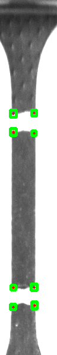

# DIC
## 项目介绍
数字图像相关法(digital image correlation DIC)，又称数字散斑相关法，
是将试件变形前后的两幅数字图像，通过相关计算获取感兴趣区域的变形信息。
由于该方法对实验环境要求极为宽松，并且具有全场测量、抗干扰能力强、测量精度高等优点。

## 目录结构
```
.
├── CMakeLists.txt
├── dataset                 # 存放数据集图片
├── include
│   ├── base.h
│   ├── loader.h
│   ├── process.h
│   └── types.h
├── LICENSE
├── main.cpp
├── README.md
├── README-ZH.md
├── result                  # 储存程序运行结果  
└── src
    ├── loader.cpp
    └── process.cpp
```

## 项目进度

### 阶段一
目前阶段可以稳定识别柔性体两边的白条。同时可以精确的得到两边白条中心点的精确位置。
通过相邻两幅图像之间白条中心的图像坐标相减即可以得到中心点的形变。

**原始图像**  


**角点检测** 


**轮廓检测** 



**结果** 


## 开发环境
- Ubuntu >= 18.04
- OpenCv >= 4.0
- cmake >= 3.16
