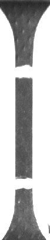
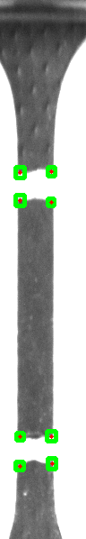
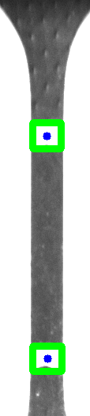

# DIC

[中文](README-ZH.md)

## Project Introduction
Digital image correlation method, also known as digital speckle correlation method,
It is the two digital images before and after the specimen is deformed,
and the deformation information of the region of interest is obtained through related calculations.
Because this method has extremely loose requirements for the experimental environment,
and has the advantages of full-field measurement, strong anti-interference ability,
and high measurement accuracy.

## Directory Structure
```
.
├── CMakeLists.txt
├── dataset                 # Store images of the datasets
├── include
│   ├── base.h
│   ├── loader.h
│   ├── process.h
│   └── types.h
├── LICENSE
├── main.cpp
├── README.md
├── README-ZH.md
├── result                  # Store program run results
└── src
    ├── loader.cpp
    └── process.cpp
```

## Project Progress

### Stage 1

**Original Image**  



**Corner Detection** 


**Contour Detection** 



**Process Result** 



## Development Environment
- Ubuntu >= 18.04
- OpenCv >= 4.0
- cmake >= 3.16
